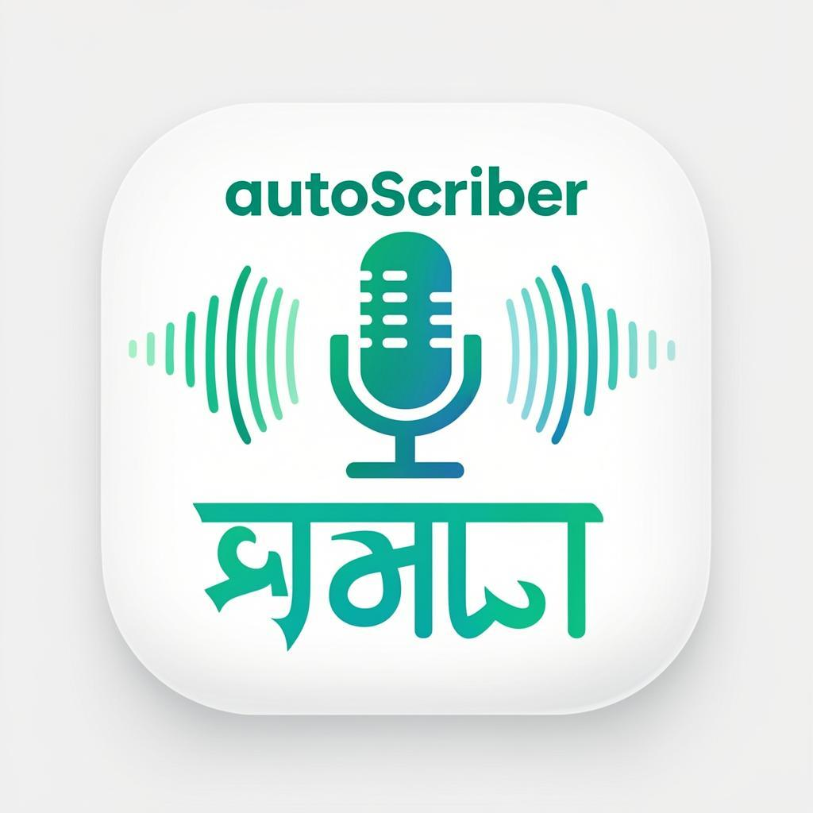

<div align="center">
  <br />
  
  <br /><br />

  <h1>AutoScribe</h1>

  <p>
    <strong>AI-powered Bangla audio transcription.</strong><br />
    Speaker diarization · Word-level sync · Thematic analysis · 6 export formats.
  </p>

  <p>
    <a href="https://nextjs.org"></a>
    <a href="https://www.typescriptlang.org"></a>
    <a href="https://tailwindcss.com"></a>
    <a href="https://prisma.io"></a>
    <a href="https://ai.google.dev"></a>
    <a href="https://bun.sh"></a>
    <a href="LICENSE"></a>
  </p>

  <p>
    <a href="#-quick-start">Quick Start</a> ·
    <a href="#-features">Features</a> ·
    <a href="#-how-it-works">How It Works</a> ·
    <a href="#-api-reference">API</a> ·
    <a href="#-contributing">Contributing</a>
  </p>

  <br />

  
  
  

  <br /><br />

</div>

---

## What is AutoScribe?

AutoScribe is a full-stack web application that transcribes Bangla (and Bangla-English code-switched) audio using **Google Gemini** or **local Ollama** models. It handles recordings of any length by splitting them into overlapping chunks, merging the results, and presenting them in a rich interactive viewer with synchronized playback, speaker diarization, thematic analysis, and multiple export formats.

Built for **researchers, journalists, and linguists** working with Bangla-English mixed speech.

---

## Privacy — Your Data Stays on Your Machine

> 
> 
> 

**Everything AutoScribe stores lives on your own computer — no third-party cloud, no remote database, no telemetry.**

| What | Where | Format |
|------|-------|--------|
| Uploaded / recorded audio files | `data/audio/` on disk | Original file format (MP3, WAV, WEBM…) |
| Transcription results (segments, speakers, timestamps) | SQLite database (`prisma/dev.db`) | JSON inside the `result` column |
| Job metadata (filename, duration, model, status) | SQLite database | Relational rows |
| App settings (API key, model, chunk config) | SQLite database | Relational row |

The **only** outbound network request is the audio chunk sent to the AI model you choose:
- **Gemini** — chunks are sent to Google's API using your own API key
- **Ollama** — chunks are processed entirely offline on your own hardware; nothing leaves your machine at all

Audio files are retained in `data/audio/` so you can replay past transcriptions from the History view. You can delete them at any time by clearing jobs from the History view or running `bun run db:reset`.

---

## Features

<table>
<tr>
<td width="50%" valign="top">

### Transcription Engine
- Gemini 2.5 Flash, 2.0 Flash, 1.5 Pro
- Local Ollama model support
- Bangla, English, code-switched audio
- Configurable chunk size + overlap
- Automatic speaker diarization (A, B, C…)
- Segment-level and word-level timestamps
- No practical audio length limit

</td>
<td width="50%" valign="top">

### Interactive Viewer
- Synchronized word-level highlighting
- Click any segment to seek audio
- Playback speed 0.5× – 2×
- Volume control + mute
- Waveform-style progress bar
- Focus mode (distraction-free)
- Full-text search across transcript

</td>
</tr>
<tr>
<td width="50%" valign="top">

### Batch Processing
- Queue multiple files at once
- Per-file real-time progress
- Parallel or sequential processing
- Persistent job history in SQLite

</td>
<td width="50%" valign="top">

### Thematic Analysis
- AI-powered theme extraction
- Key quotes and topic clustering
- Qualitative research coding support
- Powered by Gemini on completed jobs

</td>
</tr>
</table>

### Export Formats

| Format | Icon | Contents |
|--------|------|----------|
| **TXT** |  | Plain text transcript |
| **SRT** |  | Subtitle file with timestamps |
| **JSON** |  | Full data: segments, speakers, words |
| **DOCX** |  | Formatted Word document |
| **PDF** |  | Printable PDF via PDFKit |
| **ZIP** |  | All formats in one archive |

---

## Tech Stack

<table>
<tr>
<td valign="top" width="50%">

**Frontend**

| Library | Role |
|---------|------|
|  | App Router, React 19 |
|  | Utility-first CSS |
|  | Radix UI primitives |
|  | Page & element animations |
|  | Global state management |
|  | Forms + Zod validation |
|  | Charts |
|  | Icon set |

</td>
<td valign="top" width="50%">

**Backend / Infra**

| Library | Role |
|---------|------|
|  | ORM + SQLite |
|  | Primary AI model |
|  | Local model support |
|  | Audio chunking |
|  | PDF generation |
|  | Word export |
|  | ZIP bundling |
|  | Runtime |

</td>
</tr>
</table>

---

## Quick Start

### Prerequisites

| Tool | Version | Install |
|------|---------|---------|
|  | ≥ 1.1 | `curl -fsSL https://bun.sh/install \| bash` |
|  | ≥ 20 | Alternative to Bun |
|  | any | `brew install ffmpeg` |
|  | — | [Get one free](https://aistudio.google.com/app/apikey) |

### Installation

```bash
# Clone
git clone https://github.com/your-username/autoscribe.git
cd autoscribe

# Install dependencies
bun install

# Configure environment
cp .env.example .env.local
# Add GEMINI_API_KEY and DATABASE_URL to .env.local

# Initialize database
bun run db:push

# Start dev server
bun run dev
```

Open [http://localhost:3000](http://localhost:3000).

### Environment Variables

```env
# Required
GEMINI_API_KEY=your_gemini_api_key_here
DATABASE_URL=file:./prisma/dev.db

# Optional — NextAuth
NEXTAUTH_SECRET=your_secret
NEXTAUTH_URL=http://localhost:3000

# Optional — Gemini proxy
GEMINI_API_BASE_URL=https://your-proxy.example.com
```

---

## Architecture

```
┌─────────────────────────────────────────────────────────┐
│                    USER INTERFACE                       │
│   Upload · Record · Processing · Viewer · History       │
│   Batch · Thematic Analysis · Focus Mode                │
└────────────────────────┬────────────────────────────────┘
                         ↕
┌─────────────────────────────────────────────────────────┐
│              STATE MANAGEMENT  (Zustand)                │
│   View · File · Processing · Result · Audio · Settings  │
└────────────────────────┬────────────────────────────────┘
                         ↕
┌─────────────────────────────────────────────────────────┐
│                   API LAYER  (Next.js)                  │
│   /transcribe · /jobs · /export · /models · /settings   │
└────────────────────────┬────────────────────────────────┘
                         ↕
┌─────────────────────────────────────────────────────────┐
│                  BUSINESS LOGIC                         │
│   Chunker (FFmpeg) · Gemini · Ollama · Thematic Analyzer│
└────────────────────────┬────────────────────────────────┘
                         ↕
┌─────────────────────────────────────────────────────────┐
│               DATABASE  (Prisma + SQLite)               │
│   TranscriptionJob · AppSettings                        │
└────────────────────────┬────────────────────────────────┘
                         ↕
┌─────────────────────────────────────────────────────────┐
│                  EXTERNAL SERVICES                      │
│   Gemini API (cloud) · Ollama (local) · FFmpeg (binary) │
└─────────────────────────────────────────────────────────┘
```

> For the full architecture breakdown — component communication, data flow, and styling — see [ARCHITECTURE_DIAGRAM.md](ARCHITECTURE_DIAGRAM.md).

---

## How It Works

```
┌──────────────────────────────────────────────────────────────────────┐
│                                                                      │
│   Audio File (any length, any format)                                │
│        │                                                             │
│        ▼                                                             │
│   ┌─────────────────────────────────────────────────────────────┐    │
│   │  1. CHUNKING  ·  fluent-ffmpeg                              │    │
│   │     Split into N-second segments with configurable overlap  │    │
│   │     Default: 5 min chunks, 10 sec overlap                   │    │
│   └──────────────────────────┬──────────────────────────────────┘    │
│                              │                                       │
│                              ▼                                       │
│   ┌─────────────────────────────────────────────────────────────┐    │
│   │  2. TRANSCRIPTION  ·  Gemini API / Ollama                   │    │
│   │     Each chunk → AI model → structured JSON                 │    │
│   │     { speaker, text, start, end, words[] }                  │    │
│   └──────────────────────────┬──────────────────────────────────┘    │
│                              │                                       │
│                              ▼                                       │
│   ┌─────────────────────────────────────────────────────────────┐    │
│   │  3. MERGE & DEDUPLICATE                                     │    │
│   │     Overlap regions removed, timestamps adjusted            │    │
│   │     Speaker labels normalized across all chunks             │    │
│   └──────────────────────────┬──────────────────────────────────┘    │
│                              │                                       │
│                              ▼                                       │
│   ┌─────────────────────────────────────────────────────────────┐    │
│   │  4. PERSIST  ·  Prisma + SQLite                             │    │
│   │     Job record + full JSON result stored on disk            │    │
│   └──────────────────────────┬──────────────────────────────────┘    │
│                              │                                       │
│                              ▼                                       │
│              Interactive Viewer  +  Export  +  Analysis              │
│                                                                      │
└──────────────────────────────────────────────────────────────────────┘
```

---

## Project Structure

```
autoscribe/
├── src/
│   ├── app/                         # Next.js App Router
│   │   ├── page.tsx                 # Single-page app shell
│   │   └── api/
│   │       ├── jobs/                # CRUD for transcription jobs
│   │       ├── transcribe/          # Transcription endpoint
│   │       ├── settings/            # App settings
│   │       ├── models/              # Available AI models
│   │       └── export/              # Export endpoints
│   ├── components/app/
│   │   ├── audio-player.tsx         # Synchronized audio player
│   │   ├── audio-recorder.tsx       # Browser microphone recorder
│   │   ├── batch-view.tsx           # Batch job queue UI
│   │   ├── focus-player.tsx         # Distraction-free mode
│   │   ├── header.tsx               # Navigation header
│   │   ├── history-view.tsx         # Past transcriptions
│   │   ├── processing-view.tsx      # Real-time progress
│   │   ├── settings-dialog.tsx      # API key & model config
│   │   ├── thematic-analysis-view.tsx  # AI theme extraction
│   │   ├── transcription-viewer.tsx # Main transcript display
│   │   └── upload-area.tsx          # File upload + drag-drop
│   └── lib/
│       ├── store.ts                 # Zustand global state
│       ├── format-utils.ts          # Time/size formatting
│       ├── word-timing.ts           # Word-level sync helpers
│       ├── transcriber/
│       │   ├── gemini.ts            # Gemini API integration
│       │   ├── ollama.ts            # Ollama integration
│       │   ├── chunker.ts           # FFmpeg audio splitting
│       │   └── types.ts             # Shared types
│       └── thematic-analysis/
│           └── analyzer.ts          # Theme extraction logic
├── prisma/
│   └── schema.prisma                # DB schema (SQLite)
├── public/
│   ├── icon.png
│   └── logo.svg
├── electron/                        # Desktop app wrapper
│   ├── main.js
│   └── preload.js
└── .zscripts/                       # Dev/build shell scripts
```

---

## Configuration

Open **Settings** (gear icon in the header) to configure:

| Setting | Default | Description |
|---------|---------|-------------|
| Gemini API Key | — | Your Google AI Studio key |
| Gemini Base URL | — | Optional proxy URL |
| Default Model | `gemini-2.5-flash` | AI model for transcription |
| Chunk Duration | `300 s` | Audio chunk size in seconds |
| Overlap Duration | `10 s` | Overlap between chunks |
| Ollama URL | `http://localhost:11434` | Local Ollama server |

---

## Using Local Models (Ollama)

[](https://ollama.com)

1. Install [Ollama](https://ollama.com)
2. Pull a model: `ollama pull llama3.2`
3. In AutoScribe Settings, set Ollama URL to `http://localhost:11434`
4. Select the Ollama model from the model dropdown before transcribing

> **Note:** Local models generally produce lower quality Bangla transcriptions than Gemini. Gemini 2.5 Flash is strongly recommended for Bangla audio.

---

## Desktop App (Electron)

[](https://www.electronjs.org)

An Electron wrapper is included for running AutoScribe as a native desktop application.

```bash
# Build the Next.js app first
bun run build

# Then run via Electron
cd electron
npm install
npm start
```

---

## API Reference

All endpoints are under `/api/`.

| Method | Endpoint | Description |
|--------|----------|-------------|
| `POST` | `/api/transcribe` | Start a transcription job |
| `GET` | `/api/jobs` | List all jobs |
| `GET` | `/api/jobs/[id]` | Get job status & result |
| `DELETE` | `/api/jobs/[id]` | Delete a job |
| `GET` | `/api/settings` | Get app settings |
| `POST` | `/api/settings` | Update app settings |
| `GET` | `/api/models` | List available AI models |
| `GET` | `/api/export/[id]?format=pdf` | Export transcript |

**Export format values:** `txt` · `srt` · `json` · `docx` · `pdf` · `zip`

---

## Scripts

```bash
bun run dev           # Start dev server on :3000
bun run build         # Production build
bun run start         # Start production server
bun run lint          # ESLint
bun run db:push       # Sync Prisma schema to DB
bun run db:generate   # Regenerate Prisma client
bun run db:migrate    # Run migrations
bun run db:reset      # Reset database
```

---

## Database Schema

```prisma
model TranscriptionJob {
  id           String   @id @default(cuid())
  fileName     String
  fileSize     Int
  duration     Float?
  status       String   @default("pending")
  progress     Int      @default(0)
  model        String   @default("gemini-2.5-flash")
  language     String   @default("bn")
  chunksTotal  Int      @default(0)
  chunksDone   Int      @default(0)
  errorMessage String?
  result       String?  // JSON: segments, speakers, words
  audioPath    String?  // Retained for history playback
  createdAt    DateTime @default(now())
  updatedAt    DateTime @updatedAt
}

model AppSettings {
  id               String @id @default("default")
  geminiApiKey     String @default("")
  geminiApiBaseUrl String @default("")
  ollamaUrl        String @default("http://localhost:11434")
  defaultModel     String @default("gemini-2.5-flash")
  chunkDuration    Int    @default(300)
  overlapDuration  Int    @default(10)
}
```

---

## Contributing

Contributions are welcome. Please open an issue first to discuss what you'd like to change.

```bash
# 1. Fork and clone
git clone https://github.com/your-username/autoscribe.git

# 2. Create a feature branch
git checkout -b feat/your-feature

# 3. Make your changes and commit
git commit -m 'feat: add your feature'

# 4. Push and open a PR
git push origin feat/your-feature
```

**Good first issues:** improving Bangla text rendering, adding new export formats, improving the chunking merge algorithm, adding tests.

---

## License

MIT — see [LICENSE](LICENSE) for details.

---

<div align="center">

Built with care for Bangla language researchers and practitioners.

<br />

[](https://nextjs.org)
[](https://www.typescriptlang.org)
[](https://ai.google.dev)
[](https://tailwindcss.com)
[](https://prisma.io)
[](https://bun.sh)

<br />

<sub>If AutoScribe helped your research, consider giving it a star.</sub>

</div>
